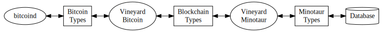

# Vineyard Minotaur - Documentation

Vineyard Minotaur is a library for monitoring blockchains and saving the resulting data to a SQL database.  The library consists of helper functions that can be used to create a monitor, and pre-built monitors.

The pre-built monitors in Minotaur fall into two categories:

* Minitaurs (or Microtaurs)  - Only watch and deal with certain addresses and don't scan from the beginning of a blockchain

* Macrotaurs - Scan and reflect an entire blockchain

Minotaur currently comes with the following Minitaurs:

* DepositMonitor - watches for certain transactions (usually transactions to a specific list of addresses.)

and the following Macrotaurs:

* Bitcoin Explorer - Tracks an entire bitcoin blockchain and stores all tx ins and outs.

* Ethereum Explorer - Tracks an entire ethereum blockchain and stores records for all contracts, token contracts, and token transfers.

## Data Structures

